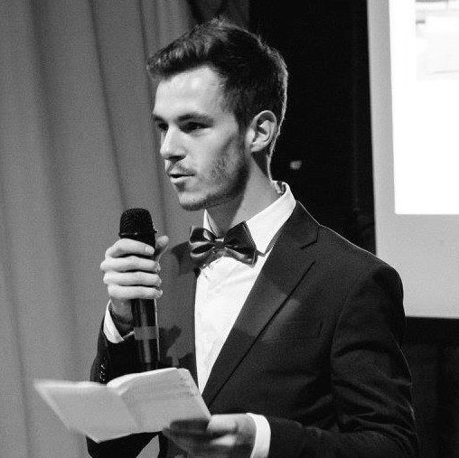

<h3>Qui suis-je ?</h3>

Je m'appelle Paul, j'ai 21 ans et je suis originaire de Tours.
 

J'ai passé en 2016 un Bac Technologique de Management et de Gestion option Gestion Finance. Ne sachant pas trop quoi faire, j'ai continué dans cette voie et j'ai entamé un BTS Management des Unités Commerciales à Nantes que j'ai du quitter en milieu d'année pour des raisons familiales. À la rentrée suivante j'ai repris mes études mais cette fois-ci en fac d'Administration Économique et Sociale, à Tours.
 

Ce "format" d'apprentissage ne me convenait pas et puisque c'était la dernière année de cette filière dans la fac de Tours, j'ai décidé d'en arrêter là avec la fac. Ce qui m'amène à vous !

<h3>Mes expériences</h3>

 Mis à part quelques stages en pharmacie, dans une compagnie aérienne ou dans un restaurant scolaire, je n'ai pas de réelles expériences professionnelles bien que chacun des ces stages m'a permis d'acquérir certaines compétences, du savoir-faire et une bonne appréhension du monde du travail.

J'ai quand même eu l'occasion d'être chroniqueur bénévole au sein d'une web-radio portée high-tech/jeux vidéo. Cette radio a vécu pendant 3 superbes années et à dû s'arrêter pour moyens financiers. J'en garde de très bons souvenirs et grâce à cette expérience je suis aujourd'hui bien plus à l'aise à l'oral.

<h3>Mes passions</h3>

Quand je ne fais pas de sport, je passe le plus clair de mon temps libre derrière un écran à regarder des séries, jouer à des jeux vidéo avec des amis ou encore m'informer sur les dernières technologies.

J'aime voyager, découvrir de nouvelles cultures et façons de vivre et j'aime également parler de tout et de rien autour d'une bonne bière avec des amis !

<h3>Pourquoi devenir Dev ? Et pourquoi rejoindre le CEFIM ?</h3> 

Tout d'abord, la programmation informatique est une chose qui m'a toujours intrigué. C'est un métier en plein essor et donc dans lequel il est peu probable de s'ennuyer ! De plus, c'est un secteur qui recrute beaucoup.
 

Pour le CEFIM, j'ai connu votre centre de formation via un ami, qui, en prenant de ses nouvelles m'a indiqué qu'il souhaitait rejoindre votre établissement. Par curiosité j'ai jeté un oeil à votre site et étant en pleine recherche sur mon orientation je me suis dit "et pourquoi pas ?". Certes je n'avais jamais codé de ma vie avant d'avoir postulé au sein de votre école mais cela ne change rien à ma motivation et mon envie d'apprendre qui sont toutes deux infaillibles.
 

<h3>Mes sites web favoris</h3>

Je n'ai pas vraiment de site/forum préféré mais je peux toutefois vous en partager quelques uns que j'apprécie :

<ul>
    <li> <a href="https://www.dealabs.com/"> Dealabs</a> : Un site qui me permet de dénicher de bonnes affaires !
    <li> <a href="https://www.tvtime.com/fr"> TvTime </a> : Celui-ci m'est super utile pour rester à jour sur mes séries préférées !
    <li> <a href="https://r6db.com/"> R6DB</a> : Lui, il me permet de connaître mes stats sur mon jeu favori

<h4>Merci à vous de m'avoir lu et à bientôt !</h4>
